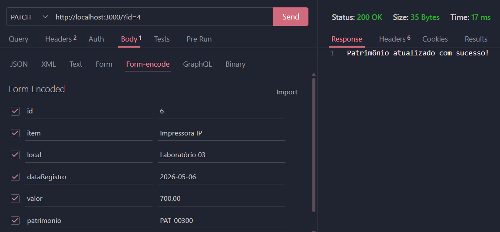
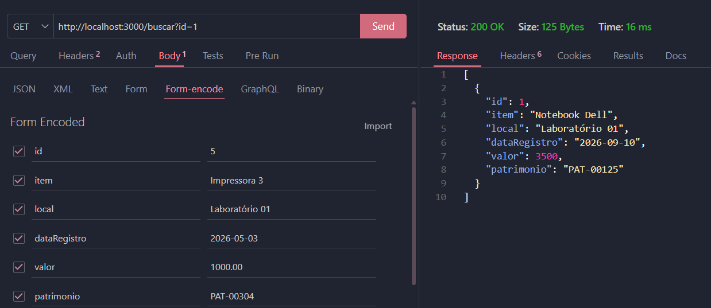
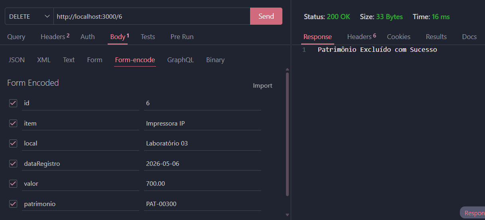
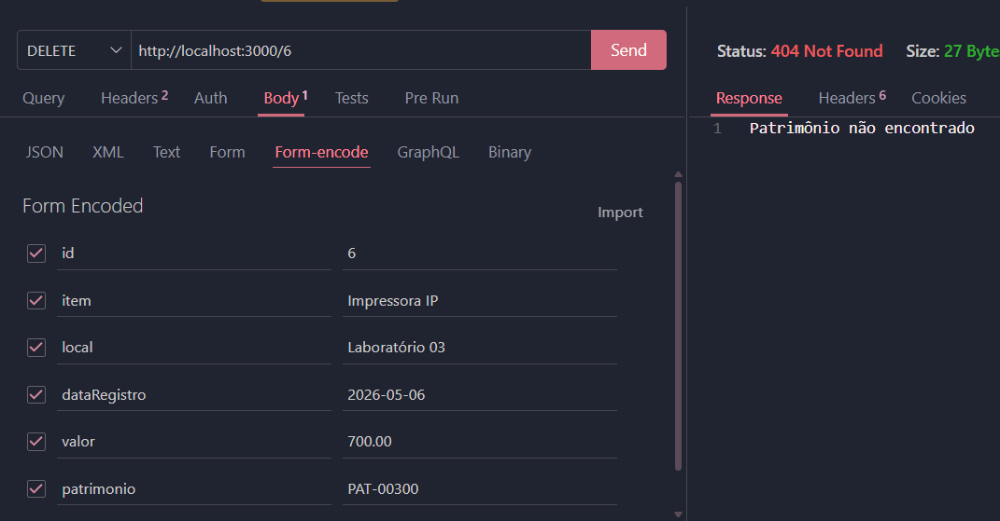

# Gerenciamento de Patrimônio 

## Descrição do projeto: 

O programa permite:

- Cadastrar patrimônios;
- Listar todos os patrimônios;
- Buscar um patrimônio pelo ID;
- Atualizar os dados de um patrimônio;
- Excluir um patrimônio pelo ID.

Os dados dos patrimônios são armazenados inicialmente no arquivo dados.json.

Cada patrimônio possui as seguintes informações:

id
item
local
dataRegistro
valor
patrimonio

## Instalação e Execução:

### Pré-requisitos

É necessário ter o Node.js instalado no computador.

### Instalação:

- 1 Clone o repositório
- 2 Abra com VsCode e em um teminal CMD ou BASH didige:
```
npm install
npm run dev
```
- 3 Teste as rotas com a extensão **Thunder Client** do *VsCode*

### Para testar o Front-End
- Abra o arquivo client/index.html com a extensão **Live Server** do *VsCode*

## Tecnologias:

- VsCode
- Node.js
- JavaScript
- JSON

## Rotas:

```
Post: http://localhost:3000
Get: http://localhost:3000
Delete: http://localhost:3000/:id
Patch: http://localhost:3000/?id=ID
Get: http://localhost:3000/buscar?id=ID

```

## Exemplos de requisições e respostas:
- Create POST: http://localhost:3000/?id=6
- Corpo
```json
{
  "id": 6,
  "item": "Impressora IP",
  "local": "Laboratório 03",
  "dataRegistro": "2026-05-06",
  "valor": 700.00,
  "patrimonio": "PAT-00300"
}
```
- Resposta
```json
 {
    "id": 6,
  "item": "Impressora IP",
  "local": "Laboratório 03",
  "dataRegistro": "2026-05-06",
  "valor": 700.00,
  "patrimonio": "PAT-00300"
  }
```
- Update PATCH: http://localhost:3000/?id=4
```json
{
"id": 4,
"item": "Impressora HP",
"local": "Laboratório 02",
"dataRegistro": "2026-05-03",
"valor": 800.00,
"patrimonio": "PAT-00302"
}
```
- Resposta
```json
{
"id": 4,
"item": "Impressora HP",
"local": "Laboratório 02",
"dataRegistro": "2026-05-03",
"valor": 800.00,
"patrimonio": "PAT-00302"
}
```

## Evidências dos testes do Thunder Client do VS Code realizados nas rotas da API:






